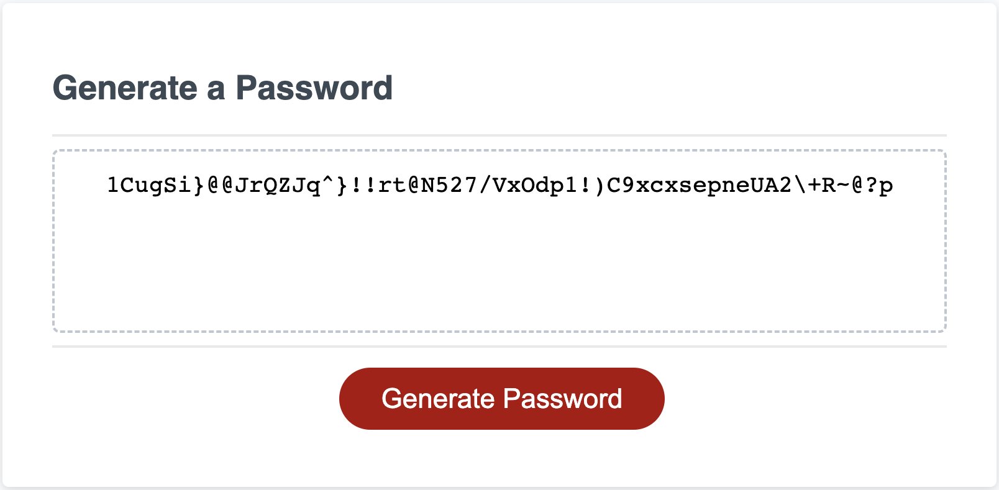

# Random Password Generator

## Description

This Javascript code generates a random password based on user input of:
* Amount of characters
* What type of characters are included
It then checks the random password to make sure the user input has been followed and outputs the password.

## Installation

To view the page visit [fawltya.github.io/random-password-generator](https://fawltya.github.io/random-password-generator/)

## Usage

Click the "Generate Password" button and fill in the prompts to create a random password.

## License

MIT License

---